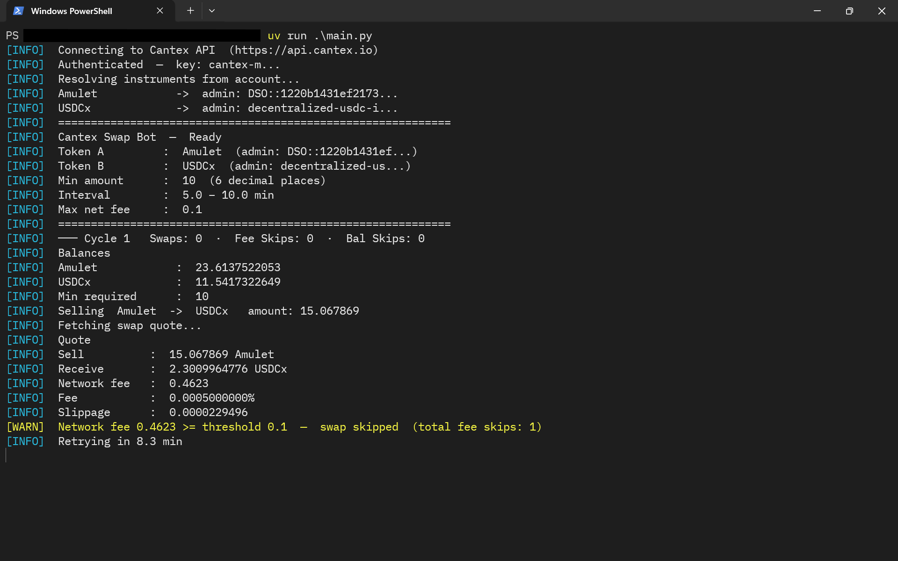
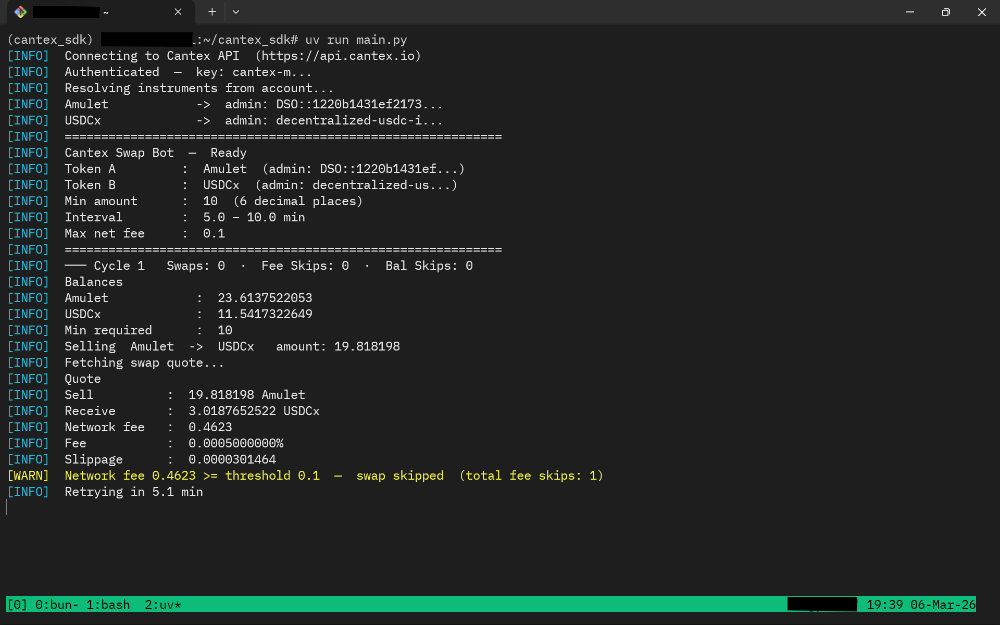
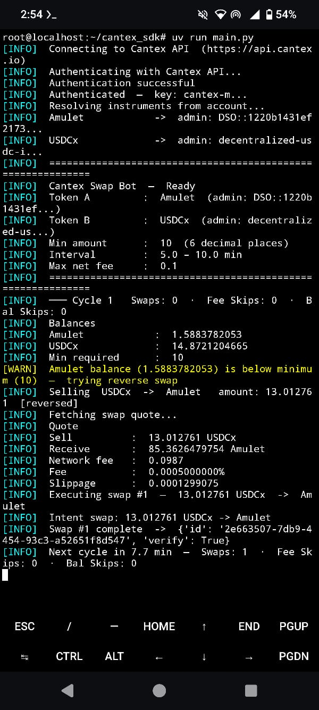

# Cantex Trading Bot

An automated multi-strategy trading bot for the [Cantex](https://cantex.io) decentralised exchange. Credentials come from a `.env` file and strategy parameters from `config.json`.

> **Fork note:** Built directly on top of [caviarnine/cantex_sdk](https://github.com/caviarnine/cantex_sdk).

## License

MIT OR Apache-2.0  
See [LICENSE-MIT](LICENSE-MIT) and [LICENSE-APACHE](LICENSE-APACHE).

---

## Supported Platforms

The bot has been tested and runs on the following platforms:

**Windows (PowerShell)**


**Linux / Ubuntu**


**Android (Termux + proot-distro)**


---

## Installation

Requires Python 3.11+ and [uv](https://github.com/astral-sh/uv).

```bash
uv sync
```

---

## Strategies

Three trading strategies are available. Select one by setting `"strategy"` in `config.json`:

| Strategy | Description |
| --- | --- |
| `"swap"` | Randomised-interval bidirectional swap loop (original) |
| `"scalp"` | Price-threshold scalping with profit target and/or stop-loss, with P&L tracking |
| `"drip"` | One-directional daily session that splits the available balance into small equal swaps |

Only the block matching the active strategy needs to be present in `config.json`, though you can keep all three blocks for easy switching.

---

## Multi-Account Mode

The bot can manage multiple accounts concurrently in a single process. Create one sub-folder per account inside an `accounts/` directory:

```
accounts/
    account1/
        config.json        ← strategy config for this account
        .env               ← CANTEX_OPERATOR_KEY, CANTEX_TRADING_KEY
        secrets/
            api_key.txt
    account2/
        config.json
        .env
        secrets/
            api_key.txt
```

All accounts run concurrently. Each uses its own credentials and strategy configuration independently. Log lines are prefixed with a **magenta `[account_name]` tag** so you can tell them apart.

If no `accounts/` directory exists the bot falls back to reading `config.json` and `.env` from the project root (single-account mode, backward-compatible).

---

## Setup

Create a `.env` file in the project root (or in each account's sub-folder for multi-account mode):

```bash
CANTEX_OPERATOR_KEY=your_operator_key_hex
CANTEX_TRADING_KEY=your_intent_key_hex
CANTEX_BASE_URL=https://api.testnet.cantex.io   # optional, defaults to testnet
```

Then edit `config.json` to set your strategy and parameters (see below).

---

## config.json Reference

```json
{
  "strategy": "drip",

  "api_key_path": "secrets/api_key.txt",

  "swap": {
    "token_a": "CC",
    "token_b": "USDCx",

    "amount_min": "10",
    "amount_decimal_places": 6,

    "interval_min_minutes": 5,
    "interval_max_minutes": 10,

    "max_network_fee": "0.1"
  },

  "scalp": {
    "token_a": "CC",
    "token_b": "USDCx",

    "amount_decimal_places": 6,

    "profit_target_pct": 2.0,
    "stop_loss_pct": 1.0,

    "min_position_amount": "0.001",

    "interval_min_seconds": 15,
    "interval_max_seconds": 30,

    "watch_interval_min_seconds": 60,
    "watch_interval_max_seconds": 120,

    "max_network_fee": "0.1"
  },

  "drip": {
    "token_a": "CC",
    "token_b": "USDCx",

    "min_swap_amount": "4",
    "num_swaps": 10,

    "amount_decimal_places": 6,

    "interval_min_seconds": 300,
    "interval_max_seconds": 600,

    "reset_hour_utc": 0,
    "reset_minute_utc": 5,

    "max_network_fee": "0.1"
  }
}
```

### Top-level fields

| Field | Required | Default | Description |
| --- | --- | --- | --- |
| `strategy` | No | `"swap"` | Active strategy: `"swap"`, `"scalp"`, or `"drip"`. |
| `api_key_path` | No | `"secrets/api_key.txt"` | Path to cache the authenticated API key on disk between restarts. Set to `null` to disable. |

### `swap` block

| Field | Required | Default | Description |
| --- | --- | --- | --- |
| `token_a` | Yes | — | Symbol or instrument ID of the primary token (e.g. `"CC"`). |
| `token_b` | Yes | — | Symbol or instrument ID of the secondary token (e.g. `"USDCx"`). |
| `amount_min` | Yes | — | Minimum sell amount per swap (e.g. `"10"`). |
| `amount_decimal_places` | No | `6` | Decimal places used when generating a random sell amount. |
| `interval_min_minutes` | Yes | — | Minimum wait time between cycles (minutes). |
| `interval_max_minutes` | Yes | — | Maximum wait time between cycles (minutes). |
| `max_network_fee` | Yes | — | Swap is skipped if the quoted network fee is >= this value. |

### `scalp` block

| Field | Required | Default | Description |
| --- | --- | --- | --- |
| `token_a` | Yes | — | Symbol or instrument ID of the primary (position) token. |
| `token_b` | Yes | — | Symbol or instrument ID of the quote token. |
| `profit_target_pct` | No* | `0` | Sell when the price rises this % above the entry price. |
| `stop_loss_pct` | No* | `0` | Sell when the price falls this % below the entry price. |
| `min_position_amount` | No | `"0.001"` | Minimum `token_a` balance considered an open position. |
| `amount_decimal_places` | No | `6` | Decimal places for sell amounts. |
| `interval_min_seconds` | Yes | — | Minimum polling interval while holding a position (seconds). |
| `interval_max_seconds` | Yes | — | Maximum polling interval while holding a position (seconds). |
| `watch_interval_min_seconds` | No | `4× interval_min` | Minimum polling interval while watching for re-entry (seconds). |
| `watch_interval_max_seconds` | No | `4× interval_max` | Maximum polling interval while watching for re-entry (seconds). |
| `max_network_fee` | Yes | — | Swap is skipped if the quoted network fee is >= this value. |

\* At least one of `profit_target_pct` or `stop_loss_pct` must be set to a positive value.

### `drip` block

| Field | Required | Default | Description |
| --- | --- | --- | --- |
| `token_a` | Yes | — | Symbol or instrument ID of the primary token. |
| `token_b` | Yes | — | Symbol or instrument ID of the secondary token. |
| `min_swap_amount` | Yes | — | Hard floor for any individual swap amount. |
| `num_swaps` | No | `10` | Target number of swaps per daily session. |
| `amount_decimal_places` | No | `6` | Rounding precision for swap amounts. |
| `interval_min_seconds` | Yes | — | Minimum wait between swaps within a session (seconds). |
| `interval_max_seconds` | Yes | — | Maximum wait between swaps within a session (seconds). |
| `reset_hour_utc` | No | `0` | UTC hour of the daily session reset. |
| `reset_minute_utc` | No | `5` | UTC minute of the daily session reset. |
| `max_network_fee` | Yes | — | If the quoted fee >= this value, waits the normal interval and retries the same swap (never skips). |

---

## Running the Bot

```bash
uv run main.py
```

Stop at any time with `Ctrl+C`.

---

## How It Works

### `swap` strategy

Each cycle the bot:

1. **Resolves instruments** — on startup, looks up live instrument IDs for `token_a` and `token_b` by matching symbols against the account's token list (case-insensitive). Exits with a clear error if either token is not found.

2. **Checks live balances** — decides the swap direction:
   - If `token_a` balance ≥ `amount_min`: sells `token_a` for `token_b`.
   - Otherwise, if `token_b` balance ≥ `amount_min`: sells `token_b` for `token_a` (reverse swap).
   - If neither balance meets the minimum: logs an error and skips the cycle.

3. **Picks a random amount** — uniformly distributed between `amount_min` and the available sell-token balance, rounded to `amount_decimal_places`.

4. **Fetches a quote** — if the quoted network fee ≥ `max_network_fee`, the swap is skipped.

5. **Executes the swap** — submits the swap and logs the result.

6. **Waits** — sleeps for a random duration between `interval_min_minutes` and `interval_max_minutes` before the next cycle.

The bot logs cumulative swap counts, fee-skip counts, and balance-skip counts each cycle.

---

### `scalp` strategy

A two-state machine (**WATCHING** ↔ **HOLDING**) that manages a recurring position in `token_a`:

1. **WATCHING state** — spends the full `token_b` balance to buy `token_a` immediately, then transitions to HOLDING. While still in WATCHING (e.g. fee was too high), polls at the slower `watch_interval` rate.

2. **HOLDING state** — polls the pool price every `interval_min_seconds` – `interval_max_seconds`. The price metric is `pool_price_before_trade` from a `token_a → token_b` probe, i.e. "how many `token_b` per one `token_a`". Exit conditions are checked in order:
   - **Stop-loss:** price ≤ entry_price × (1 − `stop_loss_pct` / 100)
   - **Profit target:** price ≥ entry_price × (1 + `profit_target_pct` / 100)

   When an exit condition fires, the entire `token_a` balance is sold and the bot returns to WATCHING.

3. **Restart safety** — a non-zero `token_a` balance (≥ `min_position_amount`) on startup is treated as an existing position. The entry price is rebaselined to the current market price so both exit conditions work correctly from the first cycle.

4. **P&L tracking** — per-trade P&L (token_b received − token_b spent) and cumulative P&L are logged on every cycle.

---

### `drip` strategy

A one-directional daily session loop:

1. **Direction detection** — at the start of each session, live balances determine the swap direction:
   - `token_a` ≥ `min_swap_amount` → sell `token_a`, buy `token_b` (A → B)
   - `token_b` ≥ `min_swap_amount` → sell `token_b`, buy `token_a` (B → A)
   - Neither → sleeps until the next daily reset and retries.

   Because all of the sell token is consumed each session, the direction naturally alternates day after day.

2. **Splitting the balance** — the available sell balance is divided into at most `num_swaps` equal parts, each guaranteed ≥ `min_swap_amount`. If the desired split would produce parts smaller than the minimum, the number of swaps is reduced automatically until the constraint is satisfied.

3. **Executing swaps** — one part is swapped per cycle, with a random wait of `interval_min_seconds` – `interval_max_seconds` between each. The final swap of the session drains the full remaining balance so nothing is left in the sell token at end-of-session.

4. **Fee retries** — if the quoted fee ≥ `max_network_fee`, the bot waits the normal interval and retries the *same* swap (never skips) to ensure the full balance is consumed before the session ends.

5. **Daily reset** — after all swaps complete (or the balance falls below `min_swap_amount`), the bot sleeps until `reset_hour_utc:reset_minute_utc` UTC and starts a new session.

6. **Restart safety** — after every completed session the UTC date is written to `drip_state.json`. On restart, if today's session is already done the bot sleeps until the next reset instead of running a duplicate session. A crash during a session leaves the state file untouched, so the bot resumes with whatever balance remains.